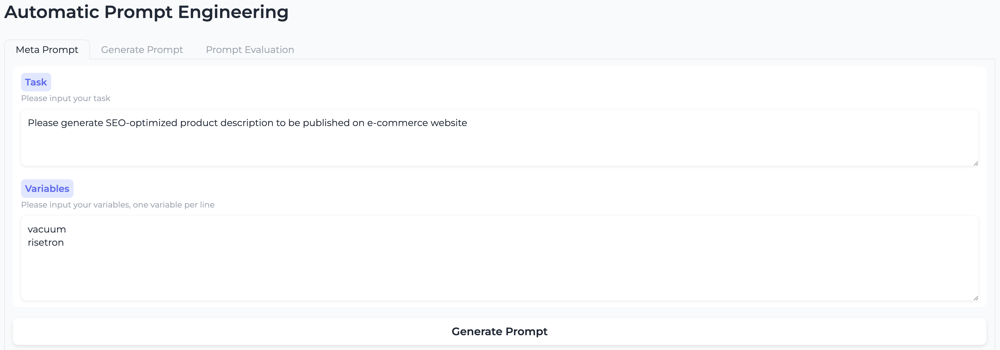
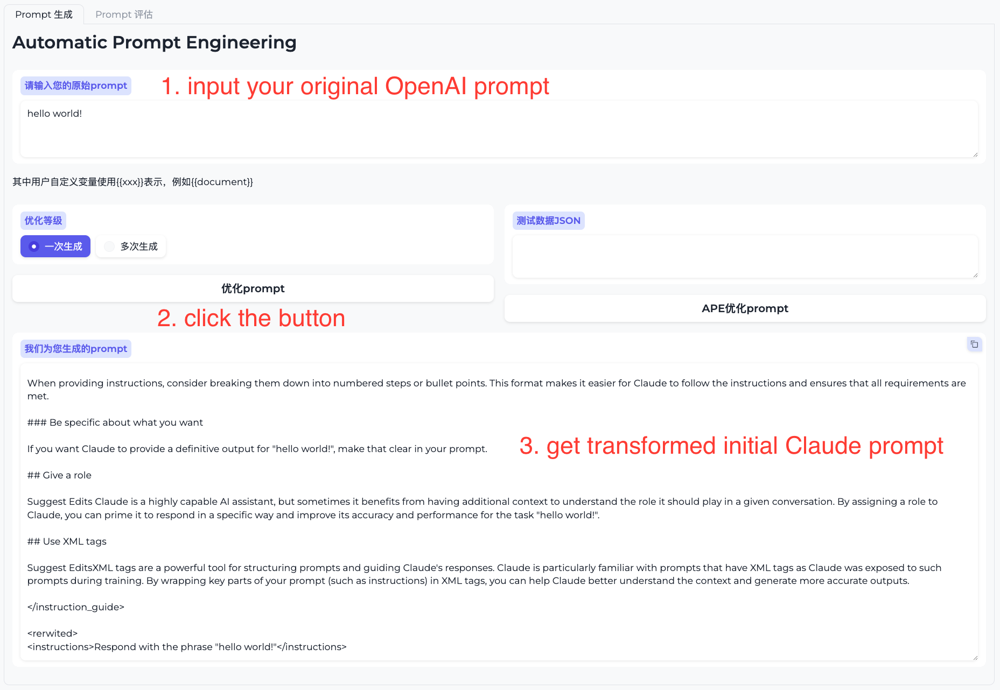
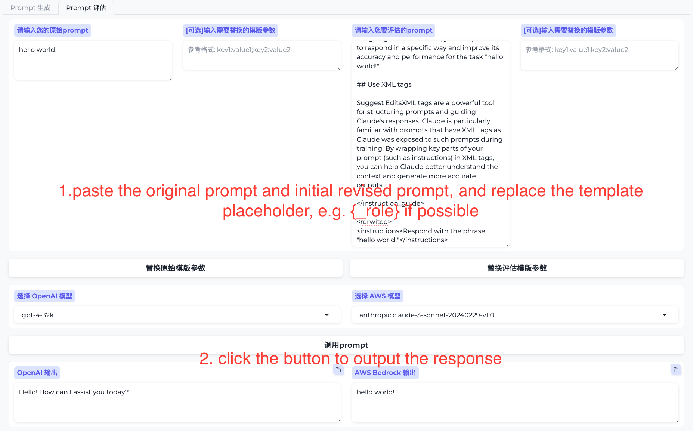
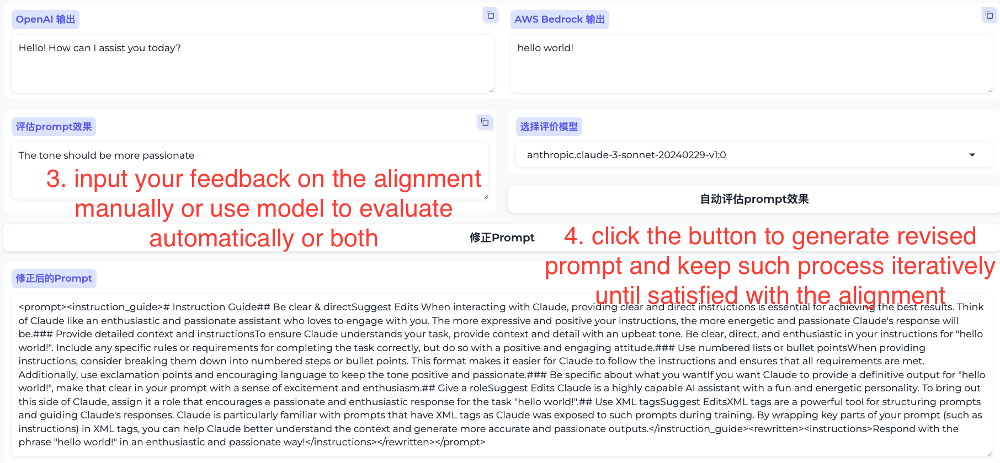

# Claude Prompt Generator

## Overall Workflow
For user not using any language model, initial prompt is generated from scratch according to Claude3 prompt guidance; For user already use language model (GPT), initial prompt is "translated" into Claude3 prompt including the transformation based on the prompt nuances between difference model characters, e.g. XML tag are recommended in Claude3. Once the initial prompt is generated, the auto & manual evaluation process are involved to gurantee the output effectivenss or alignment and revised prompt will be generated accordingly, user will keep iterating the process until the desired output is achieved. The final process will involve the manual adjustment to ensure the production ready quality, which can't be fully implemented by script or model as described as the 10% human-in-the-loop process.


## Quick Start

**Pre-requisite**
- Make sure you have an AWS account and and install the AWS CLI with AWS credentials properly configured to invoke AWS Bedrock API, see [AWS CLI](https://docs.aws.amazon.com/cli/latest/userguide/cli-configure-quickstart.html) for more information on the CLI installation and configuration.
- [Optional] Execute the script to check the Bedrock API availability in your region and priviledge to use the service, the script is located in the [src](./src/preflight/check.py) folder, run the script using command "python check.py".
- [Optional] If you want to explore the prompt evaluation function, make sure you have an OpenAI API key, see [OpenAI API](https://platform.openai.com/docs/developer-quickstart/your-api-keys) for more information.
- Install the required packages using command "pip install -r requirements.txt".
- Login to src folder, copy the .env.example file and rename to .env, fill with your OPENAI_API_KEY, OPENAI_API_URL(leave blank if is from offcial service) and REGION_NAME (Refer to AWS region, e.g. us-east-1, and currently Bedrock API is only available in limited regions, e.g.us-east-1, us-west-2, ap-southeast-1, ap-northeast-1 etc. check the availability in the [AWS region table](https://aws.amazon.com/about-aws/global-infrastructure/regional-product-services/))

**Run the demo**

```bash
cd src
python app.py
```
Login to the URL in the output, normally like http://127.0.0.1:7860, and input your original OpenAI prompt to get the tranformed Claude prompt, then you can copy the Claude prompt to the evaluation tab to compare, evaluate and iterate until such prompt is align or surpass the original prompt.

The UI is shown as below:


**Overall workflow**
1. Go to the "Prompt生成" tab, input your original OpenAI prompt and click "优化Prompt" button to get the initial Claude prompt.


2. [Experimental] Go to the "Prompt评估" tab, input your original OpenAI prompt and initial Claude prompt, click "调用Prompt" button to generate the response. Note if user have specific system template, please go the [app.py](./src/app.py) and modify the marco `default_system` to fit your own template.


3. [Experimental] Go to the "Prompt评估" tab, input your feedback on both response manually or use the "自动评估Prompt效果" button to generate the difference automatically or both, then click "修正Prompt" button to submit the feedback and get the updated Claude prompt.


4. Repeat step 2 and 3 until the Claude prompt is align or surpass the original prompt.

## Security

See [CONTRIBUTING](CONTRIBUTING.md#security-issue-notifications) for more information.

## License

This project is licensed under the Apache-2.0 License.

